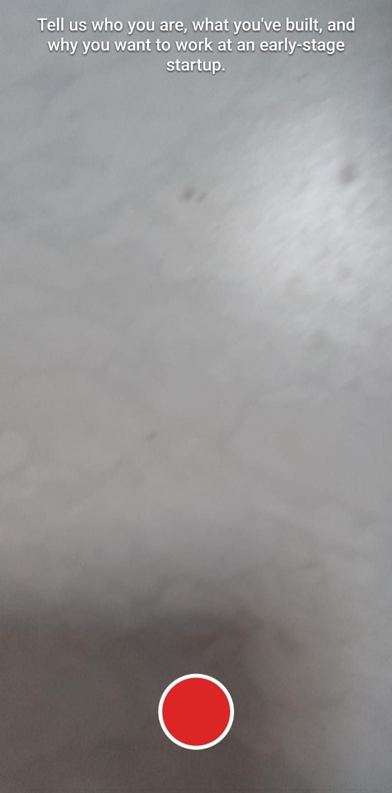

# Backdoor Candidate Video Feature

A working proof-of-concept for a startup-hiring AI agent feature: a candidate
records a short video intro on their phone, an LLM extracts hiring signal
from it, and that signal enriches their resume and gives founders a
confidence-scored summary — with the candidate's actual video only surfacing
once the signal is strong enough to be worth a founder's time.

Built end-to-end: native camera capture, real transcription,
LLM extraction, a candidate-facing review flow, and a confidence-gated
founder view.

## How it works

```
📱 Candidate records ≤60s intro on their phone (Expo / React Native)
        │
        ▼
🎙️  Backend strips audio, transcribes via Whisper (Groq)
        │
        ▼
🧠  Transcript → LLM extraction (conservative — never invents facts)
        │
        ├──▶ 📋 Candidate sees an "add to resume" checklist + transcript
        │
        └──▶ 🔒 Founder sees a summary + confidence score always,
                and the actual video only if confidence clears the bar
```

## Screenshots

| Candidate: record | Candidate: review checklist | Founder page |
|---|---|---|
|  |  |  |

More stages (preview, confirmation, backend logs, video review) are in
[`demo-images/`](demo-images/).

## Stack

- **Mobile:** Expo (React Native) — `expo-camera` for capture, `expo-video`
  for preview, cross-platform by design (Android tested via Expo Go; iOS
  needs no code changes, only an EAS build to verify).
- **Backend:** Node/Express — Groq Whisper for transcription, Groq
  Llama for extraction, `ffmpeg` to strip video down to audio-only before
  transcription (keeps uploads small and fast).
- **Founder view:** a single static HTML/JS page, no framework, no build
  step.
- **No database** — session state lives in memory + a local uploads folder,
  intentionally, since this is a demo of the *feature*, not a deployment.

## Running it locally

```bash
# backend
cd backend
cp .env.example .env   # add your Groq API key
npm install
npm start

# mobile (separate terminal)
cd mobile
npm install
npx expo start --lan   # phone and computer must be on the same Wi-Fi
```

Scan the QR code with Expo Go on Android. Update `BACKEND_URL` in
`mobile/processVideo.js` to your machine's LAN IP.

## Known limitations (it's a demo, on purpose)

- No auth, no database, no HTTPS — session state is in-memory and wiped on
  restart.
- LAN-only networking — phone and backend need to be on the same local
  network.
- Confidence threshold (70) is a placeholder constant, not tuned against
  real outcomes.
- Tested on Android; iOS uses the same cross-platform code but hasn't been
  run on a real device yet.

## Why this exists

Built as a self-directed exercise to prototype an idea in the AI-hiring
space end-to-end — camera capture, real transcription, LLM extraction with
guardrails against hallucination, and a founder-facing view with an actual
access-control gate (enforced server-side, not just hidden in the UI) —
rather than just mocking up screens.
